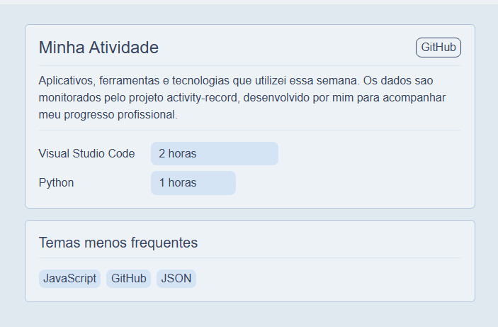

# Monitorador de atividade

Script que verifica dados da janela em foco do windows extrair palavras-chave como nome de ferramentas, tecnologias, etc, e envia esses dados automaticamente atravez da api do GitHub, permitindo alimentar dados para paginas do GitHub Pages. Feito para expor o progresso do meu trabalho no meu site de portfolio (https://fe-fe.github.io/activity).

a busca e feita procurando por tags de uma ou varias palavras (ex. "Python" ou "Stack Overflow") dentro do titulo da pagina que esta atualmente em uso, e grava o periodo em que elas sao positivas para monitorar o tempo de trabalho. 
---

